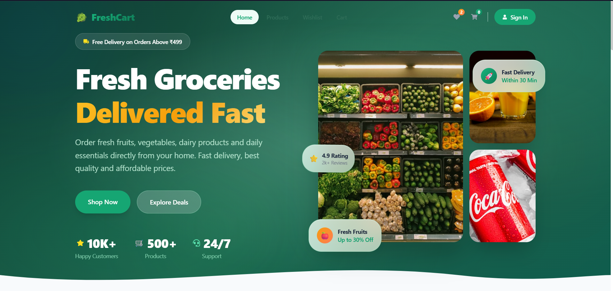
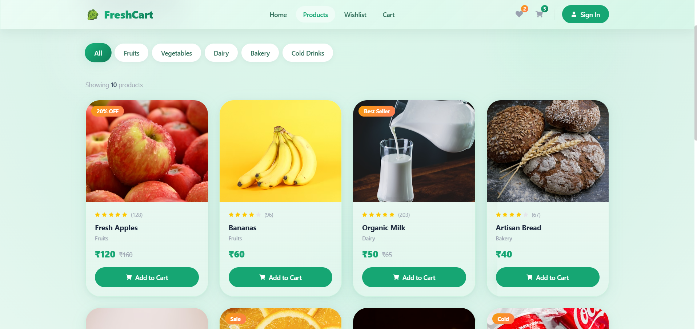
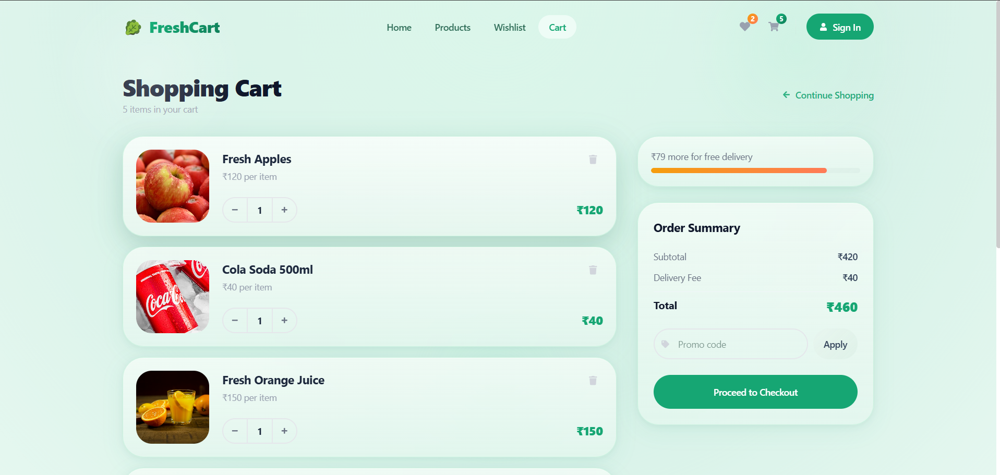
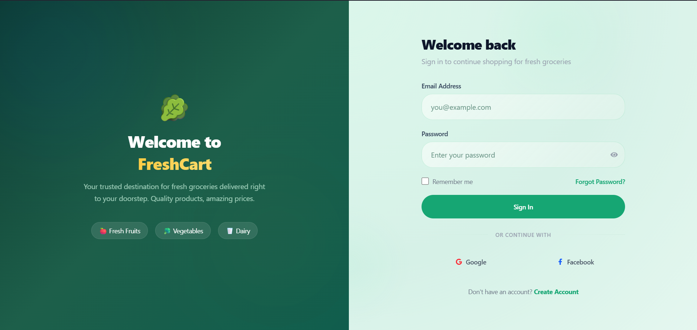

# FreshCart 🛒

FreshCart is a modern grocery e-commerce frontend built using React and Vite. It provides a clean shopping experience with product browsing, cart management, wishlist functionality, authentication pages, and responsive design.

## Screenshots

### Home Page


### Products Page


### Cart Page


### Login Page


## Features

- Home page with hero section
- Product listing page
- Product details page
- Shopping cart
- Wishlist management
- Login and Register pages
- Responsive UI
- React Context API for state management
- Fast development with Vite

## Tech Stack

- React.js
- Vite
- React Router DOM
- Context API
- CSS

## Project Structure

```text
src/
├── components/
├── pages/
├── context/
├── assets/
├── App.jsx
└── main.jsx